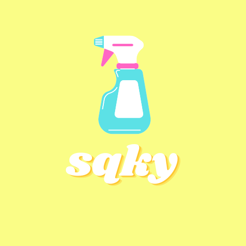

[![Contributors][contributors-shield]][contributors-url]
[![Forks][forks-shield]][forks-url]
[![Stargazers][stars-shield]][stars-url]
[![Issues][issues-shield]][issues-url]
[![LinkedIn][linkedin-shield]][linkedin-url]

<!-- PROJECT LOGO -->
<br />
<div align="center">
  <a href="https://github.com/kostastepetes/sqky-css-library">
    
  </a>

  <h3 align="center">sqky.</h3>

  <p align="center">
    ✨ sqky is a "squeaky clean" CSS library for elegant and efficient UIs made with SASS.
    <br />
    <a href="https://github.com/kostastepetes/sqky-css-library"><strong>Explore the docs »</strong></a>
    <br />
    <br />
    <a href="https://github.com/kostastepetes/sqky-css-library/blob/main/homepage.html">View Demo</a>
    ·
    <a href="https://github.com/kostastepetes/sqky-css-library/issues">Report Bug</a>
    ·
    <a href="https://github.com/kostastepetes/sqky-css-library/issues">Request Feature</a>
  </p>
</div>


<!-- TABLE OF CONTENTS -->
<details>
  <summary>Table of Contents</summary>
  <ol>
    <li>
      <a href="#about-the-project">About The Project</a>
      <ul>
        <li><a href="#built-with">Built With</a></li>
      </ul>
    </li>
    <li>
      <a href="#getting-started">Getting Started</a>
      <ul>
        <li><a href="#prerequisites">Prerequisites</a></li>
        <li><a href="#installation">Installation</a></li>
      </ul>
    </li>
    <li><a href="#usage">Usage</a></li>
    <li><a href="#roadmap">Roadmap</a></li>
    <li><a href="#contributing">Contributing</a></li>
    <li><a href="#contact">Contact</a></li>
  </ol>
</details>


<!-- ABOUT THE PROJECT -->
## About The Project

SQKY is a "squeaky clean" CSS library for elegant and efficient UIs made with SASS. It's an Open Source Project so if you are a front-of-the-frontend developer, a CSS enthusiast or just passionate about building stylish UIs...feel free to contribute

Documentation Website: 

[![Product Name Screen Shot][product-screenshot]](https://github.com/kostastepetes/sqky-css-library/blob/main/index.html)

Demo Website: 

[![Product Name Screen Shot][product-screenshot2]](https://github.com/kostastepetes/sqky-css-library/blob/main/homepage.html)

<p align="right">(<a href="#readme-top">back to top</a>)</p>


### Built With


* [![Sass][Sass]][Sass-url]
* [![Gulp][Gulp]][Gulp-url]

<p align="right">(<a href="#readme-top">back to top</a>)</p>


<!-- GETTING STARTED -->
## Getting Started

### Prerequisites


* npm
  ```sh
  npm install npm@latest -g
  ```
  
  * npm
  ```sh
  npm install gulp gulp-sass sass --save-dev
  ```
  

### Installation

1. Clone the repo
   ```sh
   git clone https://github.com/kostastepetes/sqky-css-library.git
   ```
2. Install NPM packages
   ```sh
   npm install
   ```
3. Build with gulp
   ```sh
   npx gulp
   ```

<p align="right">(<a href="#readme-top">back to top</a>)</p>


<!-- USAGE EXAMPLES -->
## Usage

* CDN
  ```sh
  <link rel="stylesheet" href="https://cdn.jsdelivr.net/gh/kostastepetes/sqky-css-library/classless/sqky-classless.min.css">
  ```

_For more examples, please refer to the [Documentation](https://github.com/kostastepetes/sqky-css-library)_

<p align="right">(<a href="#readme-top">back to top</a>)</p>


<!-- ROADMAP -->
## Roadmap

- [x] Add README
- [x] Add Animations
- [ ] Add more utilities
- [ ] Add Additional Examples
- [ ] Create npm library


See the [open issues](https://github.com/kostastepetes/sqky-css-library/issues) for a full list of proposed features (and known issues).

<p align="right">(<a href="#readme-top">back to top</a>)</p>


<!-- CONTRIBUTING -->
## Contributing

Contributions are what make the open source community such an amazing place to learn, inspire, and create. Any contributions you make are **greatly appreciated**.

1. Fork the Project
2. Create your Feature Branch (`git checkout -b feature/AmazingFeature`)
3. Commit your Changes (`git commit -m 'Add some AmazingFeature'`)
4. Push to the Branch (`git push origin feature/AmazingFeature`)
5. Open a Pull Request

<p align="right">(<a href="#readme-top">back to top</a>)</p>


<!-- CONTACT -->
## Contact

LinkedIn - [@kostastepetes](https://www.linkedin.com/in/kostas-tepetes) 

Project Link: [https://github.com/kostastepetes/sqky-css-library](https://github.com/kostastepetes/sqky-css-library)

<p align="right">(<a href="#readme-top">back to top</a>)</p>


<!-- MARKDOWN LINKS & IMAGES -->
<!-- https://www.markdownguide.org/basic-syntax/#reference-style-links -->
[contributors-shield]: https://img.shields.io/github/contributors/kostastepetes/sqky-css-library.svg?style=for-the-badge
[contributors-url]: https://github.com/kostastepetes/sqky-css-library/graphs/contributors
[forks-shield]: https://img.shields.io/github/forks/kostastepetes/sqky-css-library.svg?style=for-the-badge
[forks-url]: https://github.com/kostastepetes/sqky-css-library/network/members
[stars-shield]: https://img.shields.io/github/stars/kostastepetes/sqky-css-library.svg?style=for-the-badge
[stars-url]: https://github.com/kostastepetes/sqky-css-library/stargazers
[issues-shield]: https://img.shields.io/github/issues/kostastepetes/sqky-css-library.svg?style=for-the-badge
[issues-url]: https://github.com/kostastepetes/sqky-css-library/issues
[linkedin-shield]: https://img.shields.io/badge/-LinkedIn-black.svg?style=for-the-badge&logo=linkedin&colorB=555
[linkedin-url]: https://www.linkedin.com/in/kostas-tepetes
[product-screenshot]: ./example/img/screenshot_docs.png
[product-screenshot2]: ./example/img/screenshot_demo.png
[Sass]: https://img.shields.io/badge/SASS-hotpink.svg?style=for-the-badge&logo=SASS&logoColor=white
[Sass-url]: https://sass-lang.com/
[Gulp]: https://img.shields.io/badge/GULP-%23CF4647.svg?style=for-the-badge&logo=gulp&logoColor=white
[Gulp-url]: https://gulpjs.com/
